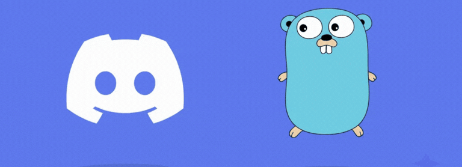
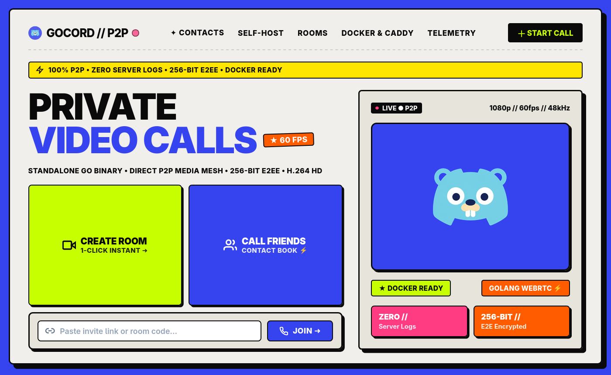

  <strong>Idiomas:</strong>
  <a href="docs/README.en-US.md">English</a> |
  <a href="docs/README.pt-BR.md">Português (Brasil)</a>

  

# Gocord

## Disclaimer

Gocord é um projeto educacional de código aberto para estudos sobre o protocolo WebRTC para videoconferência peer-to-peer. O projeto não é afiliado, patrocinado, apoiado ou endossado por qualquer serviço ou empresa de terceiros. As referências a tecnologias e serviços de terceiros são meramente descritivas.

## Privado, auto-hospedado e gratuito

Abra o navegador, compartilhe um link e converse. O Gocord é uma chamada de
vídeo auto-hospedada que é sua por inteiro — a sua conversa vai direto de um
dispositivo para o outro, sem nunca passar pelos servidores de terceiros.

  

## Como funciona

1. **Crie uma sala.** Você recebe um link privado com um código secreto embutido.
2. **Compartilhe com uma pessoa.** Como preferir — mensagem, e-mail, QR code.
3. **Conversem.** O vídeo e o áudio viajam direto entre os dois navegadores.

Simples assim. Sem cadastro, sem download, sem "por favor, verifique seu
número de telefone".

## Para quem é

- Qualquer pessoa curiosa sobre como WebRTC, TURN e criptografia de ponta a
  ponta funcionam de verdade — a stack inteira é open source.

## Por que você escolheria o Gocord

- **Sua chamada não é armazenada em lugar nenhum.** As salas vivem na memória
  e desaparecem. Não existe banco de dados, não existe histórico de chamadas
  e não existe nada para ser requisitado em juízo.
- **A mídia nunca toca o seu servidor.** Vídeo e áudio fluem diretamente
  entre os dois navegadores. O servidor apenas apresenta um para o outro.
- **O segredo do convite nunca sai do navegador.** A chave da sala viaja no
  `#fragmento` do link, que os navegadores jamais enviam para qualquer
  servidor.
- **Sua agenda de contatos é sua.** Contatos e chaves de notificação vivem
  apenas no armazenamento local do seu navegador — não existe conta e não
  existe diretório central para vazar.
- **Até as notificações de "tem alguém te chamando" são criptografadas de
  ponta a ponta.** Os servidores de push da Apple, Google e Mozilla entregam
  sua notificação como texto cifrado que eles não conseguem ler.
- **Funciona em redes modernas.** Suporte completo a IPv4 **e** IPv6, com
  fallback automático de retransmissão quando os dois navegadores não
  conseguem se alcançar diretamente.
- **Sobrevive a conexões ruins.** Se o seu Wi-Fi cai e volta, a chamada se
  recupera em vez de morrer.
- **Feito para o hardware de verdade.** O Gocord prefere H.264 — o codec que
  o seu celular e o seu notebook codificam em silício — então as chamadas
  rodam frias e sem lag, com modos de qualidade automático e de baixa
  banda.
- **Veja o que está acontecendo.** Um painel de diagnóstico ao vivo mostra o
  codec real, a resolução, a taxa de quadros, o bitrate e a latência da sua
  chamada.

## O que você precisa para rodar

Um pequeno servidor Linux e um nome de domínio. A lista é essa — o
aplicativo, incluindo a interface web, é distribuído como um único binário e
consome pouquíssimos recursos. Ele roda confortavelmente em instâncias de
entrada ou nas camadas gratuitas de nuvem.

Para desenvolvedores: `git clone`, `go run ./cmd/server`, abra
`http://localhost:8080`. Detalhes no
[INSTALLATION.md](INSTALLATION.md#quick-start-local).

## Perguntas frequentes

**Isso é realmente privado?** Tão privado quanto uma chamada entre duas
pessoas pode ser na web de hoje. A mídia é ponto a ponto e criptografada com
DTLS-SRTP. O servidor nunca vê o segredo da sua sala, nunca armazena contatos
e não mantém histórico. As notificações push são criptografadas de ponta a
ponta antes de chegarem a qualquer servidor.

**Quem hospeda o servidor pode espionar minha chamada?** Não. O servidor
apenas retransmite o aperto de mão entre os dois navegadores. Vídeo e áudio
vão direto entre os pontos e, se for necessária uma retransmissão TURN, o
tráfego TURN também é criptografado com DTLS-SRTP — um relay encaminha mídia
que ele não consegue decifrar.

**Quanto custa para hospedar?** Um domínio (~US$ 10/ano) mais a menor VM
que você conseguir alugar, muitas vezes dentro da camada gratuita do
provedor. Salas de duas pessoas ficam na memória e são leves como pena.

**Por que só duas pessoas?** Por design. Uma chamada de duas pessoas é
pequena o suficiente para manter promessas de privacidade honestas e simples
o suficiente para ser auditada.

**É um aplicativo?** Não — é um site que você hospeda. Funciona em
navegadores de desktop e mobile, com troca de câmera e tela cheia inclusas.

## Detalhes do projeto

Para arquitetura, protocolo de sinalização, design de segurança e referência
de configuração, veja o [INSTALLATION.md](INSTALLATION.md) e o próprio
código — o projeto é intencionalmente pequeno o suficiente para ser lido.

## Aviso Educacional

Este projeto é desenvolvido apenas como uma demonstração independente e
educacional de pesquisa sobre sinalização WebRTC ponto a ponto,
transmissão de mídia e criptografia de conhecimento zero usando Go e padrões
do navegador.

**Aviso de Não Afiliação:** Este projeto não é afiliado, patrocinado,
apoiado ou oficialmente associado à Discord Inc. ou a qualquer uma de suas
subsidiárias ou afiliadas. "Discord" é uma marca registrada da Discord Inc.
O nome "Gocord" é um portmanteau arbitrário e não implica nenhum apoio ou
relação. Nenhum protocolo proprietário, código de cliente ou API privada
pertencente à Discord Inc. é utilizado.

## Licença

Este projeto é licenciado sob a [Licença MIT](LICENSE). Veja o arquivo
[LICENSE](LICENSE) para o texto completo, o aviso de isenção de garantias e
a limitação de responsabilidade.
