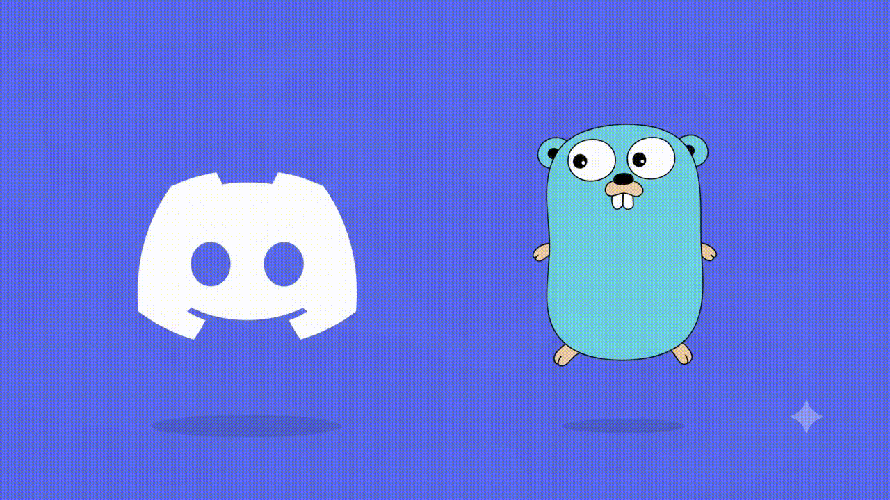

<div align="right">
  <strong>Idiomas:</strong>
  <a href="README.md">English</a> |
  <a href="README.pt-BR.md">Português (Brasil)</a>
</div>

<p align="center">
  
</p>

# Chamada de Vídeo no Navegador (Gocord)

Chamada de vídeo P2P (ponto a ponto) para duas pessoas direto no navegador, com um servidor leve de sinalização em Go e mídia nativa via WebRTC.

O servidor Go nunca faz proxy do fluxo normal de áudio/vídeo. Ele gerencia salas efêmeras em memória, autentica os dois navegadores e encaminha a sinalização SDP/ICE via WebSocket. Suporta tanto IPv4 quanto IPv6; o servidor escuta em um socket dual-stack por padrão.

## O que está implementado

- Servidor Go `net/http` escutando em socket dual-stack (IPv4 e IPv6).
- Frontend embutido em HTML/CSS/JavaScript; o binário de produção é 100% autocontido.
- Salas efêmeras em memória para duas pessoas com IDs criptograficamente seguros e segredos de 256 bits.
- Formato do link de convite: `/join/SALA#SEGREDO`.
- Apenas o hash do segredo da sala é armazenado no servidor; o segredo real nunca trafega nas requisições HTTP (fica no fragmento da URL `#`).
- Sinalização via WebSocket para eventos: `join`, `offer`, `answer`, `ice-candidate`, `peer-ready`, `peer-left`, `hangup`, `ping` e `pong`.
- Validação de candidatos ICE tanto no navegador quanto no Go.
- Sanitização de linhas de candidatos no SDP para impedir o encaminhamento de candidatos malformados.
- Mídia prioritariamente direta P2P (Peer-to-Peer); o relay TURN atua apenas como fallback seguro do ICE.
- Credenciais temporárias REST para o coturn geradas via HMAC-SHA1 a partir de um segredo compartilhado no servidor.
- Preferência de codec de vídeo priorizando H.264 via `setCodecPreferences()` antes da geração da oferta. Codecs VP8/VP9/AV1 permanecem como alternativas na lista de negociação.
- Perfis de envio: Qualidade, Automático e Baixa Largura de Banda.
- Rate limiting por cliente e teto global de salas no endpoint público de criação de salas.
- Controle nativo de congestão WebRTC ativo em todos os perfis.
- Ativar/desativar câmera, silenciar microfone, alternar câmera frontal/traseira, tela cheia e encerrar chamada.
- Recuperação automática de quedas na sinalização e na conexão de mídia.
- Diagnósticos de conexão em tempo real via `getStats()`: transporte, tipos/endereços de candidatos, codec negociado, resolução, FPS, taxa de bits (bitrate), RTT e perda de pacotes.
- Sem banco de dados e sem histórico persistente de chamadas.
- Notificações push no navegador (Web Push / RFC 8291 e RFC 8292) com entrega de conhecimento zero (zero-knowledge).
- Lista de contatos 100% no cliente (`localStorage`) e links de Cartão de Chamada (`#card=...`) sem necessidade de contas de usuário ou dados em servidor.

## Escolha de Codec

O **H.264** é priorizado porque possui aceleração por hardware em praticamente qualquer dispositivo móvel ou desktop, proporcionando menor latência de codificação e mínimo consumo de CPU e bateria.

Essa preferência fica em `web/app.js` como `PREFERRED_VIDEO_CODEC`. O AV1 oferece a melhor qualidade por bit, mas só é viável onde há codificador por hardware dedicado; por software ele consome muita CPU e adiciona latência. O codec efetivamente negociado é exibido em tempo real no painel de métricas da chamada.

## Requisitos

- Go 1.23 ou superior.
- Navegador com suporte a WebRTC e permissões de câmera/microfone.
- HTTPS em ambiente de produção.
- Para fallback em produção: um servidor coturn acessível na mesma família de endereços (IPv4/IPv6) dos participantes.

O módulo utiliza `github.com/gorilla/websocket` v1.5.3.

## Desenvolvimento Local

```bash
go mod download
go run ./cmd/server
```

### Hot Reloading (Servidor de Desenvolvimento em Tempo Real)

Para recompilar e reiniciar automaticamente a cada alteração no código Go ou no frontend (`web/`):

```bash
# Via Makefile (garante o Air automaticamente)
make dev

# Ou diretamente via Air
air
```

O listener padrão é:

```text
[::]:8080
```

Para escutar exclusivamente em loopback:

```bash
LISTEN_ADDR='[::1]:8080' \
PUBLIC_BASE_URL='http://[::1]:8080' \
go run ./cmd/server
```

Em seguida, acesse no navegador:

```text
http://[::1]:8080
```

> **Nota:** Para testar com dispositivos móveis reais (iPhone/Android), utilize HTTPS com certificado válido ou túnel seguro.

## DNS em Produção

Crie os registros A e/ou AAAA apropriados para seu domínio:

```text
call.exemplo.com.  A     203.0.113.10
call.exemplo.com.  AAAA  2001:db8:1234::10
turn.exemplo.com.  A     203.0.113.20
turn.exemplo.com.  AAAA  2001:db8:1234::20
```

## Compilação (Build)

```bash
go build -trimpath -ldflags='-s -w' -o ipv6-video-call ./cmd/server
```

Os arquivos do frontend são embutidos diretamente no executável através de `web/embed.go`.

## Configuração da Aplicação

Copie `.env.example` para `/etc/ipv6-video-call.env` e ajuste conforme suas necessidades.

Variáveis principais:

```text
LISTEN_ADDR=[::]:8080
PUBLIC_BASE_URL=https://call.exemplo.com
STUN_URLS=stun:turn.exemplo.com:3478
TURN_URLS=turn:turn.exemplo.com:3478?transport=udp,turn:turn.exemplo.com:3478?transport=tcp
TURN_SHARED_SECRET=<segredo-aleatorio>
MAX_ROOMS=5000
ROOM_CREATE_RATE=0.2
ROOM_CREATE_BURST=5
TRUST_PROXY_HEADERS=true
```

Ative `TRUST_PROXY_HEADERS=true` **apenas** quando houver um proxy reverso confiável (como o Caddy) à frente da aplicação. Ele garante que o rate limiter utilize o endereço real do cliente vindo do cabeçalho `X-Forwarded-For`. Se o servidor for exposto diretamente sem proxy, mantenha `false`.

O `TURN_SHARED_SECRET` nunca é enviado aos navegadores. O endpoint `/api/config` cria dinamicamente um usuário temporário e uma credencial compatível com o coturn via HMAC-SHA1.

## Caddy (Proxy Reverso e SSL)

Edite `deploy/Caddyfile` e substitua pelo seu domínio:

```bash
sudo cp deploy/Caddyfile /etc/caddy/Caddyfile
sudo systemctl reload caddy
```

O Caddy gerencia certificados SSL/TLS automaticamente e faz proxy das conexões WebSocket de forma transparente.

## coturn (Servidor STUN/TURN)

Instale o coturn, copie `deploy/coturn.conf` e ajuste os parâmetros necessários:

```bash
sudo cp deploy/coturn.conf /etc/turnserver.conf
sudo systemctl restart coturn
```

Libere as portas necessárias no firewall:

```text
UDP 3478
TCP 3478
UDP 49160-49200
```

## Serviço no Linux (systemd)

Crie um usuário exclusivo do sistema e instale o binário:

```bash
sudo useradd --system --home /nonexistent --shell /usr/bin/nologin ipv6call
sudo mkdir -p /opt/ipv6-video-call
sudo install -m 0755 ipv6-video-call /opt/ipv6-video-call/ipv6-video-call
sudo cp deploy/ipv6-video-call.service /etc/systemd/system/
sudo systemctl daemon-reload
sudo systemctl enable --now ipv6-video-call
```

## Recuperação de Desconexões

Sinalização e mídia trafegam de forma independente, portanto recuperam-se de forma independente:

1. **Queda do socket de sinalização:** A mídia ponto a ponto continua fluindo sem interrupções. O socket tenta reconectar em segundo plano com backoff exponencial (1s até 15s) e jitter. Ao reconectar com o mesmo ID de cliente, se a mídia continuar saudável, nenhuma renegociação desnecessária é disparada.
2. **Queda do fluxo de mídia:** Um estado `disconnected` aguarda um breve período de tolerância. Caso não se restabeleça ou mude para `failed`, o chamador dispara um *ICE restart* (`createOffer({ iceRestart: true })`).
3. **Desconexão do outro participante:** O servidor mantém a sala aberta por `EMPTY_ROOM_GRACE`. O status exibido passa a ser de espera ("aguardando retorno") em vez de encerrar imediatamente a chamada.
4. **Erros sem nova tentativa:** Desconexões intencionais (`hangup`) ou erros definitivos (`room_not_found`, `room_expired`, `unauthorized`, `room_full`) interrompem o loop de tentativas e alertam o usuário.

## Fluxo da Chamada (Call Flow)

```text
Navegador A                  Sinalização Go                   Navegador B
     |                              |                               |
     | POST /api/rooms              |                               |
     |----------------------------->|                               |
     | SALA + #SEGREDO              |                               |
     |<-----------------------------|                               |
     |                              |                               |
     | WSS join + segredo           |          WSS join + segredo   |
     |----------------------------->|<------------------------------|
     |                              |                               |
     |            peer-ready        |          peer-ready           |
     |<-----------------------------|------------------------------>|
     |                              |                               |
     | SDP offer                    |                               |
     |----------------------------->|------------------------------>|
     |                              |                               |
     |                         SDP answer                           |
     |<-----------------------------|<------------------------------|
     |                              |                               |
     |====== WebRTC DTLS-SRTP sobre o par de candidatos selecionado =|
```

## Privacidade e Segurança

- No nível de log padrão, o servidor **não** registra IDs de salas, segredos de convite, mensagens SDP, candidatos ICE, endereços IP, metadados de mídia ou duração de chamadas.
- Ativar `DEBUG_SIGNALING=1` eleva os logs para debug para diagnóstico de sinalização, mas **nunca** expõe segredos, corpos SDP ou endereços IP.
- As salas existem apenas na memória RAM e expiram após `ROOM_TTL`.

### Privacidade nas Notificações Web Push

- **Sem Diretório Central de Contatos:** As inscrições push (`endpoint`, `p256dh`, `auth`) e nomes de contatos ficam exclusivamente no `localStorage` do navegador do usuário.
- **Criptografia de Ponta a Ponta no Push:** O payload de notificação é criptografado no servidor conforme RFC 8291 (`aes128gcm` ECDH P-256 HKDF) com a chave pública do destinatário. Serviços intermediários de push (Apple APNs, Google FCM, Mozilla) enxergam apenas texto cifrado.
- **Segredos de Sala Efêmeros:** O link da chamada traz o `#SEGREDO` no fragmento da URL, sendo entregue ao destinatário diretamente via payload criptografado, sem que o segredo trafegue em requisições HTTP normais.

## Testes

```bash
go test ./...
```

A suíte de testes valida capacidade de salas, estabilidade de reconexão, limpeza automática de salas expiradas, validação e sanitização de candidatos ICE no SDP, credenciais REST do coturn, proteção contra headers forjados e headers estritos de segurança (CSP sem inline script/style).

## Aviso Legal e Educacional (Educational Disclaimer)

Este projeto foi desenvolvido estritamente como uma demonstração de pesquisa e projeto educacional independente sobre protocolos WebRTC peer-to-peer, sinalização efêmera e criptografia ponta a ponta em Go.

**Nota de Não Afiliação:** Este projeto não é afiliado, patrocinado, endossado ou oficialmente conectado de qualquer forma à Discord Inc. ou a qualquer uma de suas subsidiárias. "Discord" é uma marca registrada da Discord Inc. O nome "Gocord" é um termo independente e não implica qualquer relação ou endosso. Nenhuma API proprietária, código ou serviço da Discord Inc. é utilizado neste projeto.

## Licença

Este projeto é distribuído sob a licença [MIT](LICENSE). Consulte o arquivo [LICENSE](LICENSE) para o texto completo, termos de isenção de garantia e limitação de responsabilidade.
